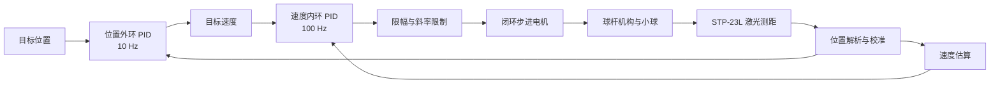

# 基于 STM32 的球杆平衡控制系统

> 一个从自制控制板、底层驱动到串级控制算法均由个人独立完成的嵌入式控制项目。

本项目以 STM32F103C8T6 为主控，使用激光测距传感器获取小球位置，通过“位置外环 + 速度内环”的串级 PID 控制闭环步进电机改变球杆倾角，使小球回到并稳定在目标位置。项目使用定时器中断保证控制周期，使用 DMA 与中断完成传感器接收、OLED 刷新和串口调试，并针对真实机构加入了滤波、限幅、死区、斜率限制和异常回水平等处理。

项目目前已完成实物调试，可以正常编译、下载和运行，实际控制效果良好。由于演示素材和量化测试数据尚未整理，本文不会虚构超调量、稳定时间或稳态误差；后续将以实测曲线补充。

## 项目演示

> **封面图片占位**  
> 建议拍摄一张横向、背景干净的整机照片：需要同时看到球杆、小球、连杆、电机、自制控制板、激光传感器和 OLED。可放在 `docs/assets/system-overview.jpg`。

<!-- 素材补充后取消下一行注释： -->

> **演示视频占位**  
> 建议录制 20～40 秒视频：上电初始化 → 将小球放在零点一侧 → 系统主动回正 → 手动扰动后再次恢复。镜头中保留 OLED；最好同步录屏 VOFA+ 曲线。视频可上传到 GitHub Release、Bilibili 或其他平台，并将链接放在这里。

> **控制曲线占位**  
> 建议截取 VOFA+ 中“目标位置、实际位置、实际速度、电机脉冲”四条曲线，保留横纵坐标和一次完整的回正过程。可放在 `docs/assets/control-response.png`。

<!-- 素材补充后取消下一行注释： -->

## 我完成了什么

这是个人独立项目，我负责了完整的设计和调试闭环：

- 根据球杆机构需求设计并绘制控制板，完成器件选型、接口规划、焊接与硬件排查；
- 完成 STM32 外设配置、板级驱动、传感器协议解析和应用任务组织；
- 设计位置/速度串级 PID 控制结构，并实现速度估算、滤波与命令整形；
- 完成机械零点、传感器原点、控制极性、PID 和电机运动参数的实物整定；
- 使用 OLED、串口日志、Keil Watch 和 VOFA+ 波形定位抖动、过冲、通信竞争等问题；
- 对失败的 IMU 前馈方案进行原因分析，改用激光位置闭环后完成稳定控制。

## 核心亮点

### 1. 多速率串级 PID

控制器不是直接用位置误差驱动电机，而是拆分成两个时间尺度：

- **位置外环（10 Hz）**：将目标位置与实际位置的误差转换为目标速度；
- **速度内环（100 Hz）**：跟踪目标速度，并将控制量转换为电机绝对位置脉冲；
- **驱动执行层**：闭环步进电机改变杆角，通过重力沿杆方向的分力控制小球运动。

两个控制环分别由 TIM3 和 TIM2 的固定周期中断触发，避免 OLED、按键和调试输出造成控制周期抖动。



### 2. 面向低频位置传感器的速度估算

激光传感器约 10 Hz 更新，而速度环运行在 100 Hz。代码没有对同一份位置数据机械地重复差分，而是进行了以下处理：

1. 位置变化超过阈值时才认为收到新样本；
2. 使用实际时间间隔计算差分速度；
3. 对原始速度进行尖峰限幅；
4. 使用一阶低通滤波抑制差分噪声；
5. 长时间无位置变化时将残余速度归零。

这一处理降低了低速传感器数据对速度环微分项造成的冲击。

### 3. DMA + IDLE 流式协议解析

STP-23L 激光测距数据通过 USART2 的环形 DMA 接收，并结合 IDLE 事件解析。解析器支持：

- 一帧数据跨越多次 DMA 回调；
- DMA 缓冲区回卷后的分段处理；
- 从半帧、错帧和坏帧中重新同步；
- 固定字段与校验和验证；
- 对每帧 12 个测距点剔除无效值后求平均；
- 中断写入、应用读取之间的短临界区保护。

相比阻塞接收或逐字节中断，这种方式减少了 CPU 等待时间，也提升了连续数据流下的恢复能力。

### 4. 控制安全与执行器保护

真实机构不能只关注 PID 公式，项目还加入了多层约束：

- PID 积分限幅、输出限幅和误差过零清积分；
- 位置与速度死区，稳定后清除控制器历史状态；
- 目标速度和电机位置命令的变化率限制；
- PID 最大控制量为 ±250 pulse，机械软件限位为 ±280 pulse；
- 命令发送迟滞和最小发送间隔，减少无效通信；
- UART DMA 忙时跳过当前命令，由下一个控制周期重新尝试；
- 控制关闭或测距无效时清除控制状态，并命令电机回到水平位置。

### 5. 可观察、可调试

- 128×64 SSD1306 OLED 实时显示内外环 PID 参数、位置和电机脉冲；
- USART2 DMA 输出位置与电机命令，可接入 VOFA+ 查看波形；
- 所有主要控制参数集中在 [`User_BSP/Control_Config.h`](User_BSP/Control_Config.h)；
- 保留失败方案和调参记录，便于复盘控制策略的演进过程。

## 从失败方案到闭环控制

项目早期尝试使用 MPU6050 加速度数据估计杆倾角，再通过连杆标定表和软件 S 曲线规划电机运动。实物测试发现，加速度计测得的是重力分量与机构动态加速度的叠加，无法可靠区分“杆发生倾斜”和“机构/小球正在运动”，容易形成错误反馈并导致控制发散。

因此当前方案改为直接测量小球位置：激光位置形成位置外环，位置差分形成速度反馈，再由速度内环控制杆角。旧方案代码仍保留作设计复盘，但当前 TIM1 回调中的 IMU 更新已关闭，主流程使用的是激光测距串级控制。

这次迭代让我对一个问题有了更具体的认识：传感器能输出数据，不等于它提供了当前控制目标所需的可观测状态；控制结构必须建立在可信的反馈量上。

## 系统组成

### 硬件

| 模块 | 当前实现 | 作用 |
| --- | --- | --- |
| 主控 | STM32F103C8T6，72 MHz | 控制计算与外设调度 |
| 位置传感器 | STP-23L 激光测距模块 | 获取小球位置，约 10 Hz 输出 |
| 姿态传感器 | MPU6050 | 启动校准及早期方案验证，当前主控制不依赖 |
| 执行器 | 闭环步进电机 + Emm_V5 驱动器 | 改变球杆倾角 |
| 显示 | 128×64 SSD1306 OLED | 显示参数与运行状态 |
| 人机输入 | 3 个独立按键 | 手动位置测试与模式调试 |
| 控制板 | 自制 PCB | 主控、通信、供电和接口连接 |

> **硬件图片占位**  
> 建议补充控制板正反面高清照片或 PCB 3D 渲染，并用箭头标注电源、下载口、电机、激光、OLED、MPU6050 和按键接口。可放在 `docs/assets/controller-board.jpg`。

> **原理图占位**  
> 建议导出一张可阅读的 PDF，同时在 README 放一张低分辨率总览图。图中至少包含电源树、STM32 最小系统、SWD、两路 UART、两路 I2C 和接口保护。若暂不公开完整 PCB，至少提供连接图和 BOM。

### 固件接口分配

以下信息来自当前 CubeMX/Keil 工程配置，实际接线仍应以你的原理图为准。

| 外设 | 引脚/配置 | 用途 |
| --- | --- | --- |
| USART1 | PA9 TX、PA10 RX，115200 baud | Emm_V5 电机驱动通信 |
| USART2 | PA2 TX、PA3 RX，230400 baud | RX 接收 STP-23L；TX 输出调试数据 |
| I2C1 | PB8 SCL、PB9 SDA，400 kHz | SSD1306 OLED，地址 `0x3C` |
| I2C2 | PB10 SCL、PB11 SDA，400 kHz | MPU6050 |
| TIM2 | 100 Hz | 速度内环 |
| TIM3 | 10 Hz | 位置外环 |
| TIM1 | 300 Hz | 早期 IMU 方案预留，当前采样调用关闭 |
| GPIO 输入 | PB13、PB14、PB15，上拉 | 三个按键，低电平有效 |
| GPIO 输出 | PB12、PA8、PA11 | 状态指示 |

## 软件架构

```text
Ping_Hen/
├─ Core/
│  ├─ Inc/                    # CubeMX 生成的外设头文件
│  └─ Src/                    # 系统时钟、GPIO、DMA、I2C、UART、TIM 和中断入口
├─ Drivers/                   # STM32 HAL 与 CMSIS
├─ User_BSP/
│  ├─ User_Task.c/.h          # 初始化、主循环任务、控制环和调试输出
│  ├─ Control_Config.h        # 控制参数集中配置
│  ├─ PID_Cnotrol.c/.h        # PID 算法与状态清理
│  ├─ BSP_Emm_V5.c/.h         # 电机驱动二次封装
│  └─ math_utils.c/.h         # 数学辅助函数
├─ User_Drivers/
│  ├─ Laser_uart.c/.h         # STP-23L DMA + IDLE 接收和帧解析
│  ├─ Emm_V5.c/.h             # 电机驱动协议
│  ├─ mpu6050.c/.h            # MPU6050 驱动与校准
│  ├─ ssd1306*                # OLED 驱动、字库和测试代码
│  └─ Printf_DMA.c/.h         # DMA 串口格式化输出
├─ MDK-ARM/                   # Keil MDK 工程文件及本地构建产物
├─ 理解用文件夹/              # 控制链路理解与试验代码，不参与当前构建
├─ 老驱动/                    # 旧版 MPU6050 驱动，不参与当前构建
├─ Ping_Hen.ioc               # STM32CubeMX 配置
└─ LICENSE                    # GPL-3.0
```

### 运行时任务

| 执行上下文 | 任务 | 说明 |
| --- | --- | --- |
| 上电一次 | `User_Task_Init()` | 初始化 MPU6050、OLED、电机参数与激光 DMA |
| 主循环 | 参数、OLED、串口、按键任务 | 完成人机交互和状态输出，不承担控制周期 |
| TIM2 中断 | `User_Task_Speed_Control()` | 100 Hz 速度估算与速度内环 |
| TIM3 中断 | `User_Task_Position_Control()` | 10 Hz 位置外环 |
| USART2 DMA/IDLE | 激光帧解析 | 后台更新最新有效距离 |
| I2C1 事件中断 | OLED 刷新 | 非阻塞发送显存数据 |

## 主要控制参数

当前实物参数集中在 [`User_BSP/Control_Config.h`](User_BSP/Control_Config.h)。这些值与具体杆长、连杆尺寸、电机细分、摩擦和传感器安装位置相关，移植时不能直接照搬。

| 参数 | 当前值 | 含义 |
| --- | ---: | --- |
| 位置外环频率 | 10 Hz | 与激光数据更新速度匹配 |
| 速度内环频率 | 100 Hz | 提高执行器响应速度 |
| 位置环 PID | Kp 0.6 / Ki 0.7 / Kd 0 | 位置误差到目标速度 |
| 速度环 PID | Kp 1.2 / Ki 0.1 / Kd 0.3 | 速度误差到电机脉冲 |
| 激光原点 | 190 mm | 原始距离减去该值后作为相对位置 |
| 位置死区 | 1.5 mm | 进入目标邻域后清除位置环状态 |
| 速度死区 | 3 mm/s | 目标与实测速度均较小时回水平 |
| 速度滤波截止频率 | 3 Hz | 平滑位置差分速度 |
| 电机最大控制量 | ±250 pulse | PID 输出限制 |
| 机械软件限位 | ±280 pulse | 防止触碰机构限位 |
| 电机命令斜率 | 1200 pulse/s | 抑制目标位置突变 |
| 驱动器速度/加速度参数 | 400 RPM / 180 | Emm_V5 快速位置模式参数 |

## 快速开始

### 1. 软件环境

当前工程使用以下环境完成最近一次本地构建：

- Keil µVision / MDK-ARM 5.37；
- Arm Compiler 5.06 update 7；
- ARM CMSIS 5.9.0；
- Keil STM32F1xx DFP 2.4.1；
- STM32CubeMX（仅在需要重新生成外设配置时使用）。

其他版本可能也能正常构建，但尚未建立自动化兼容性测试。

### 2. 获取代码并打开工程

```bash
git clone <你的仓库地址>
cd Ping_Hen
```

使用 Keil 打开：

```text
MDK-ARM/Ping_Hen.uvprojx
```

选择 `Ping_Hen` Target，完成 Build 后通过 ST-Link 下载到 STM32F103C8T6。

最近一次构建记录为 **0 Error**，程序占用为 `Code=27998`、`RO-data=19670`、`RW-data=420`、`ZI-data=7612` 字节；构建日志仍有警告，见“后续计划”。

### 3. 首次上电前检查

> [!WARNING]
> 球杆和连杆存在机械限位。首次调试必须先取下小球、断开不必要负载，并确认急停/断电方式可用。不要在未验证方向和行程时直接开启闭环。

1. 确认电源电压、电机相线、传感器接口和共地连接正确；
2. 确认电机驱动器地址为 `1`，并已设置可重复的机械/编码器零点；
3. 在手动模式下验证 `-250 ~ +250 pulse` 不会撞击机构；
4. 校准杆水平位置 `BALL_MOTOR_LEVEL_PULSE`；
5. 测量并修改激光原点 `BALL_CONTROL_LASER_ORIGIN_MM`；
6. 将球放在零点右侧进行小幅测试，若小球继续向右加速，修改 `BALL_CONTROL_POLARITY`；
7. 上电初始化期间保持 MPU6050 静止，等待 300 个样本的零偏校准完成。

### 4. 观察运行数据

OLED 会显示速度环/位置环的 Kp、Ki、Kd，以及激光位置和电机脉冲。USART2 TX 使用 DMA 输出：

```text
POS: <位置 mm>,<电机脉冲>
```

可根据实际串口连接，在 VOFA+ 中选择 230400 baud，并按当前文本格式配置 FireWater 或自定义解析。建议后续增加目标位置和估算速度两列，使调参曲线更完整。

## 移植与调参建议

不同机构至少需要重新确认以下参数：

1. `BALL_CONTROL_LASER_ORIGIN_MM`：小球位于目标点时的激光原始距离；
2. `BALL_MOTOR_LEVEL_PULSE`：杆真实水平时的电机位置；
3. `BALL_CONTROL_POLARITY`：机械安装和传感器坐标方向；
4. `BALL_MOTOR_MIN/MAX_RELATIVE_PULSE`：实测安全行程；
5. 内外环 PID、死区、滤波频率和命令变化率。

推荐调参顺序：先保证机械安全和极性正确，再只调速度内环，使其具备足够阻尼；随后接入位置外环并逐步提高位置响应；最后根据实测曲线调整积分、死区和斜率限制。每次只改变一个主要变量，并保留相同初始条件下的对比曲线。

## 当前边界与后续计划

这个仓库仍在持续完善，下面是基于当前代码的下一步计划：

- [ ] 增加“最后有效激光帧时间戳”，通信中断超时后主动判为无效并回水平；
- [ ] 让中间按键切换当前使用的 `ball_control_enabled`，统一旧方案与新方案的模式变量；
- [ ] 给 OLED 和串口调试任务增加明确刷新周期，减少无意义的重复格式化和忙等；
- [ ] 修正 `printf_dma()` 的截断长度处理并增加发送超时，避免异常长日志导致越界读取或长期阻塞；
- [ ] 清理 `volatile PID_t *` 类型不匹配和文件末尾换行等编译警告；
- [ ] 拆分体积较大的 `User_Task.c`，将传感器、估算器、控制器和 UI 分层；
- [ ] 为激光帧解析、PID、限幅和速度估算增加主机端单元测试；
- [ ] 补充目标阶跃、扰动恢复、稳态误差和重复性测试数据；
- [ ] 补充原理图、PCB、BOM、接线说明和演示素材。

## 开源前检查

当前代码可以用于学习和复现，但正式公开仓库前建议完成以下整理：

- 删除并停止跟踪 Keil 生成的 `.axf`、`.map`、`.crf`、`.d`、构建日志等文件；
- 删除个人 µVision 配置文件，并检查 Git 历史中是否包含本机路径或许可证信息；
- 扩充 `.gitignore`，只保留可复现工程所必需的源码、工程配置和文档；
- 为第三方的 Emm_V5、SSD1306、MPU6050、STM32 HAL/CMSIS 代码核对原始许可证并保留署名；
- 增加 `THIRD_PARTY_NOTICES.md`，说明第三方代码来源、修改内容和许可证；
- 公布自制板资料前，再检查丝印、原理图标题栏和生产文件中的姓名、电话、订单号等信息。

## 开源许可

仓库根目录当前使用 [GNU General Public License v3.0](LICENSE)。你可以在遵守 GPL-3.0 的前提下学习、修改和分发本项目。

第三方库、厂商 HAL/CMSIS 和电机驱动示例的著作权及许可仍归各自作者所有；根目录许可证不会自动替代其原始许可。正式发布前请完成第三方授权核对。

## 交流

如果这个项目对你的嵌入式学习、控制算法实践或球杆机构调试有帮助，欢迎提交 Issue 交流。若你基于不同的机械结构复现，也欢迎分享参数、波形和改进方案。

---

关键词：`STM32F103` · `嵌入式软件` · `串级 PID` · `Ball and Beam` · `DMA` · `UART IDLE` · `激光测距` · `闭环步进电机` · `VOFA+`
